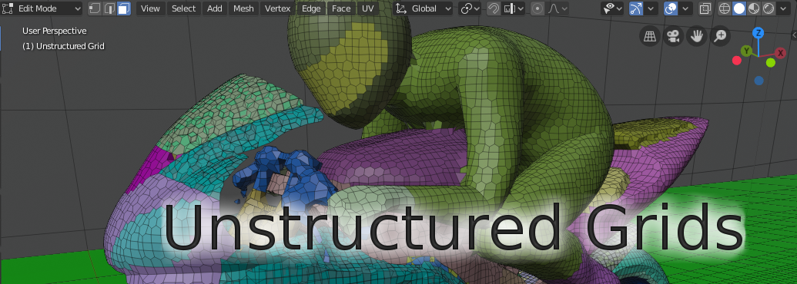
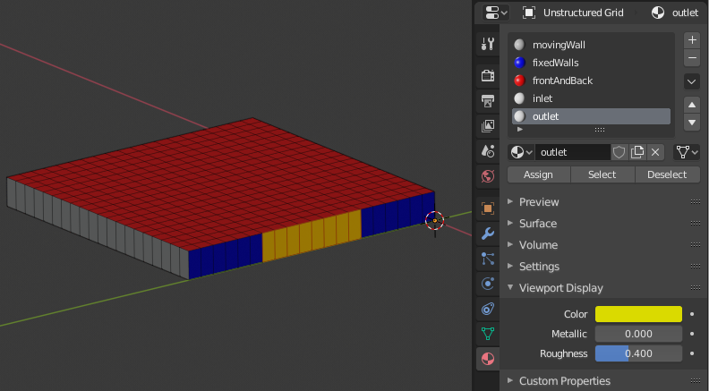
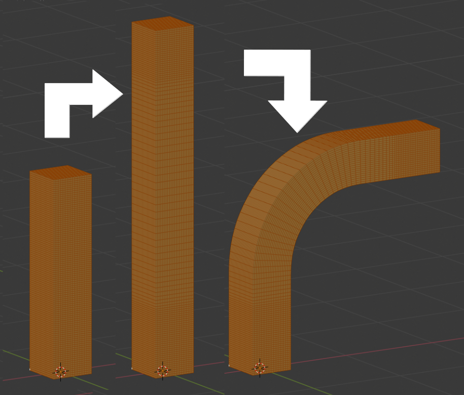

# Unstructured Grids for Blender

## Introduction

[Unstructured Grids (UG)](https://github.com/tkeskita/unstructured_grids)
is an add-on for [Blender 2.80](https://www.blender.org)
for creating, importing, editing and exporting of
3D volume meshes composed of arbitrary polyhedron cells (a.k.a [3D
unstructured grids](https://en.wikipedia.org/wiki/Unstructured_grid)).
Add-on handles mesh topology and geometry (the definition of cells).
Field data (cell data or point data) for the mesh is disregarded.
Editing includes tasks like moving of selected vertices, deletion of
existing cells, extrusion of new cells, and assignation of selected
faces and cells to named boundaries and zones. The user of the add-on
is assumed to know Blender modelling and material systems on a basic
level.

## Features and Limitations

- Since volume meshes are not natively supported in Blender, 
  cell and face information related to unstructured grids are kept in
  separate Python object data model. Data is stored as text strings.
  Internal faces or edges are not shown in Blender, but vertices are
  visible in Edit Mode.

- Cell description is compatible with
  [OpenFOAM](https://openfoam.org/)
  [PolyMesh description](https://cfd.direct/openfoam/user-guide/mesh-description/),
  including named boundary faces (patches), and cell and face zones.
  Unstructured grid is defined by lists of cells, cell faces and face vertices.
  Import and export is provided also for [VTK](https://vtk.org/)
  [Unstructured Grid (.vtu) XML ASCII file format](https://lorensen.github.io/VTKExamples/site/VTKFileFormats/).

- Supported native Blender operations include moving of vertices, assigning
  materials to faces (boundary patches) and assigning vertices to vertex groups
  (zones). Otherwise, modifications of unstructured grids rely on special
  operators ('UG' in operator name) which keep UG Data and Blender
  mesh object contents in sync.

- Operations can be slow for large meshes.

## Use Case Examples

- Change boundary patch assignments for existing/new patches (select
  faces in Blender, then assign selection to existing/new
  material).

  

- Moving of vertices. This can be applied for tasks like:
  
  - Elongation/stretching of cells (by using Proportional Editing in
    Blender)

  - Curving simulation domain, to model e.g. pipes (by applying Curve
    Modifier in Blender)

  

  - Scaling/moving/rotation of a selected part of the mesh

  

  - Extrude a mesh profile (on left), and twist the result (on right)

## Status

This add-on is in feature development stage.
Currently implemented features include:

- Import and Export of uncompressed ASCII PolyMesh files (boundary, faces,
  neighbour, owner, points). PolyMesh Import and Export operators are located
  in File menu under Import and Export.

- Unstructured grid data is saved as text strings (UG Storage) inside Blend files.

- Undo (CTRL + Z) is not working correctly, but one-step undo is
  supported indirectly: Use *Update to Storage* to sync changes made
  in Blender for safekeeping in UG Storage. To undo, use *Restore from
  Storage*.

- Boundary face patches can be changed by assigning material for faces

- Selection of cells via operators (UG Select Cells Inclusive/Exclusive)

- Cell and face zones can be created, visualized and edited by
  modifying Vertex Groups in Blender.

- UG GUI Panel is shown as a Tab in Sidebar in 3D Viewport, for easy
  access to UG operators and information.

- Deletion of selected cells to carve voids into the domain.

- Extrusion of new cells (one or several layers) from selected faces
  (Warning: slow operation) (Note: Experimental feature).

- Dissolve Edges (merge selected vertices connected by edges)
  (Note: Experimental feature).

- Import/Export of VTK Unstructured Grids (XML uncompressed ASCII
  (.vtu) file format)

- Cell integrity check and statistics routine (Check Selected Cells)

## Installation

- Add-on code is available at
  https://github.com/tkeskita/unstructured_grids. To download add-on from
  Github, Select “Clone or download”, then “Download ZIP”.

- Start Blender 2.80, go to “File” –> “User Preferences” –> “Add-ons” –> “Install” –> open the add-on zip file.

- Activate the “Unstructured Grids for Blender” add-on in Preferences. Add-on is located in
  Mesh category.

- Note: Python Logging console messages may be useful in case of problems.
  More information in file *\_\_init\_\_.py*.

## Development Ideas for Future

- Split Cells (Edge Division) (e.g. hexahedral cell is split to 8
  cells, tetrahedral cell is split into 4 cells)

- Dissolve Internal Faces (merge cells)

- Merge Overlapping Boundary Faces (e.g. to merge two mesh regions)

- Separate Internal Faces (convert internal face to two boundary faces)

- Split Cells (Center Slicing) (polyhedron cell face vertices are
  connected to cell center)

- Show Cells (creates temporary object with faces around
  selected cells)

- Fix Intersecting Boundaries (move boundary vertices so
  that boundary faces don't intersect each other)

- Support for OpenFOAM sets?

- Improve extrusion of new cells. Method could be improved by
  including smoothing of vertex normals, and extrusion length could be
  based on neighbour face-to-face angles or vertex normal angles to
  create hypergeometric extrusions, something like
  [PyHyp](https://github.com/mdolab/pyhyp) or
  [Cassiopee](http://elsa.onera.fr/Cassiopee/) do.

- Mesh Quality metrics + operator to select bad cells. Definition of
  bad cells depend on target simulation type, so there would need to
  be several metrics. This would be nice-to-have but not essential,
  since it is possible to use *checkMesh* utility of OpenFOAM, or
  e.g. Mesh Quality filter in Paraview or e.g.
  [BVTKNodes](https://github.com/tkeskita/BVtkNodes)
  to evaluate mesh quality.

### OpenFOAM Trade Mark Notice

This offering is not approved or endorsed by OpenCFD Limited, producer
and distributor of the OpenFOAM software via www.openfoam.com, and
owner of the OPENFOAM® and OpenCFD® trade marks.
