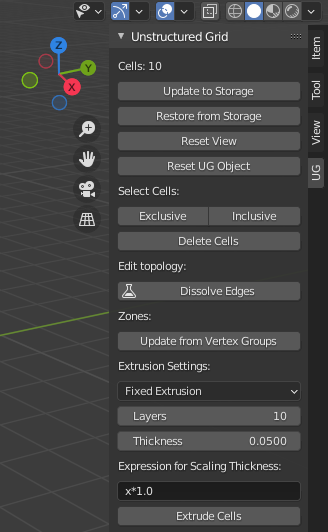
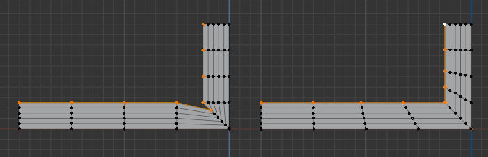
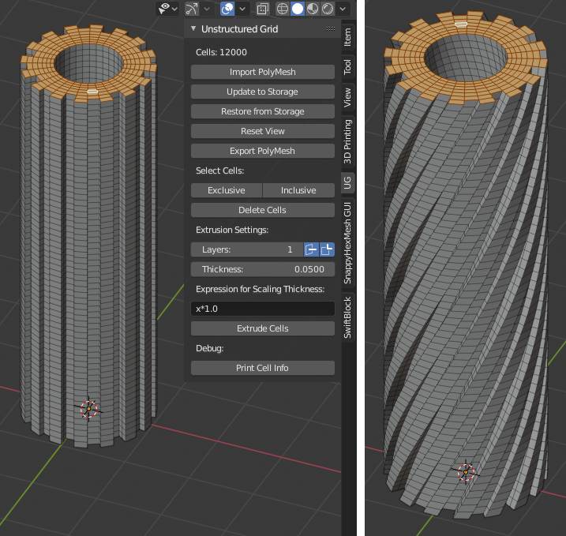

Unstructured Grids Addon for Blender
====================================

.. image:: images/ug_title.png

Introduction
------------

`Unstructured Grids (UG) <https://github.com/tkeskita/unstructured_grids>`_
is an add-on for `Blender <https://www.blender.org>`_
for creating, importing, editing and exporting of
3D finite volume meshes composed of arbitrary polyhedron cells (a.k.a 
`3D unstructured grids <https://en.wikipedia.org/wiki/Unstructured_grid>`_.
The motivation for this work was the lack of open source volume 
mesh editors. There are numerous finite volume mesh generators,
but practically no general or visual editors.

Add-on only handles mesh topology and geometry (the definition of cells).
Field data (cell data or point data) for the mesh is disregarded.
Editing includes tasks like moving of selected vertices, deletion of
existing cells, extrusion of new cells, and assignation of selected
faces and cells to named boundaries and zones. The user of the add-on
is assumed to know Blender modelling and material systems on a basic
level.

.. warning::

   This add-on is experimental. There are no guarantees. Use at your
   own risk. Always check the resulting exported mesh before use in
   simulations.

Main Features and Limitations
-----------------------------

- Since volume meshes are not natively supported in Blender, 
  cell and face information related to unstructured grids are kept in
  separate Python object data model. Data is stored as text strings.
  Internal faces or edges are not shown in Blender, but boundary faces
  and all vertices are visible in Edit Mode.

- Unstructured grid is defined by lists of cells, cell faces and face vertices.
  Cell description is compatible with
  `OpenFOAM <https://openfoam.org/>`_
  `PolyMesh description <https://cfd.direct/openfoam/user-guide/mesh-description/>`_,
  including named boundary faces (patches), and cell and face zones.
  Import and export is provided also for `VTK <https://vtk.org/>`_
  `Unstructured Grid (.vtu) XML ASCII file format <https://kitware.github.io/vtk-examples/site/VTKFileFormats/>`_.

- Supported native Blender operations include moving of vertices, assigning
  materials to faces (boundary patches) and assigning vertices to vertex groups
  (zones). Otherwise, modifications of unstructured grids rely on special
  operators ('UG' in operator name) which keep UG Data and Blender
  mesh object contents in sync.

- New cells can be created by extrusion from a face selection.

- **Many operations are slow for large meshes.**

- Tested on Blender LTS version 3.6.

Installation
------------

- Add-on code is available at
  https://github.com/tkeskita/unstructured_grids. To download add-on from
  Github, Select "Code" --> “Download ZIP”.

- Start Blender, go to “File” –> “User Preferences” –> “Add-ons” –> “Install” –> open the add-on zip file.

- Activate the “Unstructured Grids for Blender” add-on in Preferences. Add-on is located in
  Mesh category.

.. Note::
   
   Python Logging messages (printed to terminal if Blender is
   started from a terminal) may be useful in case of problems.
   For more information take a look at file *\_\_init\_\_.py*.

UG Toolbar
----------

Add-on is visible in Blender’s 3D Viewport in Sidebar as a separate
tab. To view the add-on panels, you must

- Select a mesh object (in 3D Viewport or in Outliner)

- View Sidebar (“View” –> “Toggle Sidebar” or press “N” key in 3D Viewport)

- Select “UG” tab in the Sidebar

Note that if no unstructred grid has been imported or created by
extrusion from a face selection, then most of the tools are inactive.

Unstructured Grid Object
------------------------

Import and *Extrude Cells* operators (see below) create a Blender Mesh
Object called **Unstructured Grid**, to contain the unstructured
grid. Add-on ignores all other Blender objects.

Import and Export
-----------------

You can import and export unstructured grid via menu commands File ->
Import/Export. Add-on supports currently two types of volume mesh
formats:

- **OpenFOAM PolyMesh**: OpenFOAM's PolyMesh ASCII format
  (see `PolyMesh description`_). 
  Select the polyMesh directory -> OK. 

- **VTK Unstructured Grid (.vtu)**: `Unstructured Grid (.vtu) XML ASCII file format`_. 
  Note: Export currently creates VTK polyhedrons.

Extrusion of New Cells
----------------------

**Extrude Cells** operator creates new cells from face selection based
on Extrusion Settings shown on the Toolbar. To extrude cells, first
select one or more faces in the Unstructured Grid object (or any mesh
object for first extrusion), then run **Extrude Cells** operator by
clicking on the named button in the toolbar. Extrusion settings
include:

- *Extrustion Method* drop-down menu lists options for available
  extrusion methods:

  - **Fixed Extrusion Method** is the most basic method. New cells are
    created by extruding each selected face vertex towards the vertex
    normal direction. Total vertex extrusion length is equal to
    *Thickness*. No checks for result quality or possible
    intersections are made.

  - **Shell Extrusion Method** is a more advanced method,
    meant for addition of flat cells (boundary layer cells) on top
    of an existing surface mesh. This method extrudes each selected
    vertex in a direction, which is iteratively adjusted using
    surrounding vertex extrusion directions. The aim of this method is
    to apply an extrusion direction which reduces the risk of
    creating intersections near convex shapes.

    .. warning::

        This method may create highly non-orthogonal or skewed
        faces. The method will create intersecting faces for highly
        convex shapes and shapes where two extrusion fronts meet, if
        extrusion thickness is too large (depends on the case).

    - **Ensure Layer Thickness** option scales extrusion length for
      the Shell Extrusion Method so that the layer thickness specified
      in the *Thickness* option is approximately reached. This option
      may cause increase of layer thickness for convex shapes. If this
      option is disabled, then total vertex extrusion length is equal to
      *Thickness*.

    - **Interactive Correction** creates a temporary Interactive
      Correction object, before actually extruding the cells, so that
      the user has a possibility to manually alter the extrusion
      directions (vertex locations) for vertices. When the locations
      have been edited in Blender, run *Finish Extrude Cells* to
      proceed with the actual cell creation.

    - **Check for Intersections** enables intersection detection for
      interactive correction. Intersections can occur when extrusion directions of
      adjacent vertices cross each other. This happens when extrusion
      thickness is too large for the Shell Extrusion Method. There is
      no definite value for when intersections start to occur. If this
      option is enabled and intersections are detected, a warning is
      issued in Blender info text (text shown in Blender bottom bar),
      and intersecting vertices are selected (highlighted in Vertex
      Select Mode).

      Note: Intersections are currently detected only for extrusion top
      faces (but not for side faces).

      The intersection detection algorithm casts rays from numerous
      starting points slighly away (perturbed locations) from each
      vertex towards neighbour vertices. Intersection is assumed to
      occur if a ray hits a non-neighbour face. The perturbation
      length (how far away ray casting start point is from current
      vertex) is calculated from the mesh as: maximum bounding box
      side length, multiplied by Perturbation Factor. For example, a
      Perturbation Factor value of 0.0001 means that if maximum
      bounding box side length for the mesh is e.g. 10 m, then vertex
      location is perturbed by 1 mm in the intersection detection.

    - **Perturbation Factor** determines the perturbation length scale
      factor for the intersection detection algorithm (see above). The
      value of Perturbation Factor affects the accuracy of the
      intersection detection, so you may try to change this value if
      the result of intersection detection is bad.

  - **Hyperbolic Extrusion Method** is a highly experimental extrusion
    method which is neither documented nor supported. Do not use, for
    development and testing purposes only.

- *Layers* specifies the number of cell layers for extrusion

- *Thickness* specifies the total length of side edges for extruded
  cells, or target height for all of the extruded cell layers.

- *Expression for Scaling Thickness* allows user to specify a Python
  expression which scales *Thickness* for each layer. 
  *x* in the expression is layer thickness. The default value
  *x\*1.0* will keep thickness constant.

- *Create Trajectory Object* will optionally create an additional
  trajectory object, which contains the vertex extrusion edges only,
  for debugging purposes.

Note: Boundary vertices are always extruded in the vertex normal
direction.

The following image illustrates the difference between the Fixed
Extrusion (on left) and the Shell Extrusion (on right) methods:

Storage and View Operators
--------------------------

- The top part of the Unstructured Grid Toolbar shows current
  number of cells, or a warning if there are no cells defined.

- *Update to Storage* takes all changes made to the Unstructured Grid
  Object, and stores them in text storage variables. This allows
  saving of a snapshot of current status in work memory. This operator
  is run automatically when .blend file is saved.

- *Restore from Storage* discards Unstructed Grid Object and rebuilds
  it based on the information in the storage variables. This operator
  is run automatically when .blend file is opened.

.. note::

   You can use *Update to Storage* and *Restore from Storage* commands
   as a rudimentary one-step undo operation. Using Blender's Undo
   command (CTRL-Z) is unfortunately not currently supported.

- *Reset View* refreshes the view. It shows boundary faces and hides
  deleted faces and vertices.

Cell operations
---------------

Cell selection is based on vertex selection. You can first select any
vertices of the Unstructured Grid Object in Vertex Selection Mode in
Edit Mode. Then select operator:

- *Exclusive* will reduce current vertex selection to whole cells.  If
  vertex selection does not include all vertices of any one cell, then
  vertices are deselected.

- *Inclusive* will extend current vertex selection to cover whole
  cells. If selected vertex is part of any cells, then all other
  vertices of those cells is added to vertex selection.

*Delete Cells* will remove whole cells included in vertex selection.
Deletion of cells creates new boundary faces, which are added to
*default* material (boundary patch, see below). Note: Cell deletions
are not displayed correctly in Object Mode.

Edit topology
-------------

*Dissolve Edges* merges selected vertices which are connected by edges
in pairwise manner. TODO: Experimental, needs to be improved.

*Shrink Boundary* moves vertices of selected faces "inwards" towards
 vertex normal direction by a distance specified in *Shrinking
 Distance*. TODO: Experimental feature, needs to be improved.

Zones
-----

Zones are essentially an additional list of faces (internal or
external) or cells in OpenFOAM. Zones are used to control subset of
faces/cells in simulations. Note: VTK unstructured grids do not
currently support zones.

Zones are specified by assigning vertices to 
`Blender Vertex Groups <https://docs.blender.org/manual/en/latest/modeling/meshes/properties/vertex_groups/index.html>`_.
Vertex group naming defines zone type. Cell zone *x* must be named as
**cellZone_x**, and face zone *y* must be named as **faceZone_y**.

*Update from Vertex Groups* operator must be run after assigning
vertices to vertex groups to update changes to unstructured grids.

If any face zones exist, then following additional options become
visible:

- *Edit Face Zone Orientation* is a number, which specifies which face
  zone will be affected by the following operations:

- *Start Editing* will create a temporary **Face Zone Orientation**
  Object (which contains only the faces of the face zone), switch on
  Edit Mode and Face Orientation Overlay, which colors faces to blue
  (face normal towards view) or red (face normal away from view). In
  this mode, the user can select faces and flip their normals if
  needed (by using the *Flip Face Orientations* operator), to
  harmonize all face normals. Harmonizing is needed to get
  e.g. correct face flux sums in OpenFOAM simulation for face zones.

- *Finish Editing* will exit the normal editing mode, transfer
  information of faces whose normals need to be flipped (flipMap) back
  to Unstructured Grid Object, and finally delete the temporary Face
  Zone Orientation Object.

Info About Selected Items
-------------------------

These operators show information for debug purposes.

Modification of Boundary Patches
--------------------------------

Each boundary face of the volume mesh is assigned to a named list,
called boundary patch in OpenFOAM terminology. This allows
specification of boundary conditions for simulations. All boundary
faces must belong to one (and only one) boundary patch. The add-on
uses
`Blender`s Material System <https://docs.blender.org/manual/en/latest/render/materials/index.html>`_
to visualize and specify boundary patches. The material name is used
as patch name.

.. image:: images/ug_boundary_patch_assign.png

To assign faces to materials (patches), you must select faces (using
Face Selection Mode in Edit Mode), select or create new material, and
the click on Assign button.

Transformation of mesh vertices
-------------------------------

Blender has a powerful system for selecting vertices and operating on
selections (e.g. moving, rotating or scaling) in 3D Viewport. Blender
also supports inputting exact measurements for operations. This makes
it possible to edit volume meshes (without topology changes) in
Blender simply by moving vertices.

.. Note::

   Direct deletion of vertices or faces from Blender Mesh Object is not
   supported. Only *Delete Cells* operator can be used to keep Blender
   Object in sync with the Python cell data model.

The add-on can be applied for tasks like elongation/stretching of
cells (by using Proportional Editing in Blender), or curving
simulation domain, to model e.g. pipes (by applying Curve Modifier in
Blender)

.. image:: images/ug_stretch_and_bend.png

Another example shows extrusion of a mesh profile (on left), followed by
twisting of the result (on right):

Example
-------

A modified example of the OpenFOAM cavity tutorial mesh is located
in the *examples* folder in the add-on sources (file name *cavity.blend*).

OpenFOAM Export Workflow
------------------------

- Export volume mesh from Blender (File -> Export -> OpenFOAM PolyMesh (UG))
  into an *empty* polyMesh folder (under your OpenFOAM case folder
  *constant/polyMesh*).

- Run OpenFOAM command `renumberMesh -overwrite` to optimize
  bandwidth. This is needed, because order of faces and cells exported
  from Blender are not optimized in any way, so the resulting mesh may
  be inefficient for numerical solution.

- Run OpenFOAM command `checkMesh` to make sure mesh does not contain
  errors.

Help and Feedback
-----------------

Please use GitHub issues for requests, discussion and feedback:
https://github.com/tkeskita/unstructured_grids/issues

If you use this add-on, please star the project in GitHub!

OpenFOAM Trade Mark Notice
--------------------------

This offering is not approved or endorsed by OpenCFD Limited, producer
and distributor of the OpenFOAM software via www.openfoam.com, and
owner of the OPENFOAM® and OpenCFD® trade marks.
